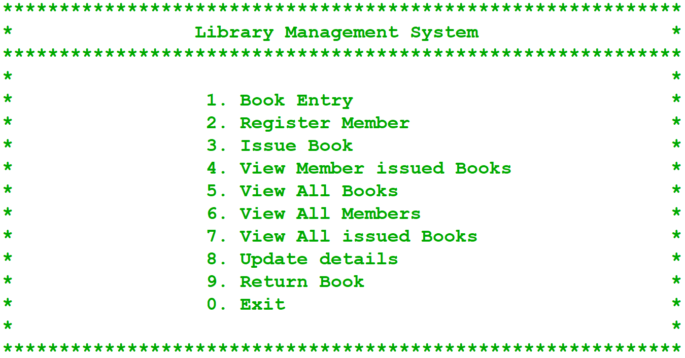

# Library Management System (CLI) — Windows Only

A simple Command-Line Library Management System built using Python and MySQL.  
This project helps manage books and members in a library with issue/return log features — all through a terminal interface.

---

## Features

- Add / Delete / Update books and members  
- Display all books and members  
- Search books by ID or Name  
- Sort books by ID or Name  
- Issue and Return books  
- View complete register/logs (issue/return history)

---

## Requirements

- Python 3.x  
- MySQL Server (running on `localhost`)  
- MySQL Database: `library`  
- Python Package:
  ```bash
  pip install mysql-connector-python
  ```
- OS: Windows only (uses `os.system('cls')` for screen clearing)

---

## Database Schema

### Database Name: `library`

### Table: `book`
```sql
CREATE TABLE book (
    id INT PRIMARY KEY,
    name VARCHAR(100),
    author VARCHAR(100),
    publisher VARCHAR(100),
    qty INT
);
```

### Table: `member`
```sql
CREATE TABLE member (
    id INT PRIMARY KEY,
    name VARCHAR(100),
    phone VARCHAR(15)
);
```

### Table: `register`
```sql
CREATE TABLE register (
    book_id INT,
    book_name VARCHAR(100),
    member_id INT,
    member_name VARCHAR(100),
    date DATE,
    action VARCHAR(20)
);
```

---

## How to Run

1. Start MySQL server and ensure the `library` database with tables is created  
2. Clone this repository:
   ```bash
   git clone https://github.com/rajdeep-das-2007/Library_Management_System_Python.git
   cd Library_Management_System_Python
   ```
3. Run the script:
   ```bash
   python library_management.py
   ```
4. Use the terminal interface to manage the library

---

## Notes

- Works only on Windows OS due to usage of `cls` command for screen clearing  
- Ensure correct MySQL credentials and database name in the script  
- No GUI — pure terminal-based interaction  
- All data is stored directly in MySQL tables  

---

## Operations



## Library Management System – Features

### 1. Book Entry
Register a new book with the following details:
- Book No.
- Book Name
- Author Name
- Price
- Quantity (Number of Copies)

### 2. Register Member
Add a new library member by entering:
- Member No.
- Member Name
- Mobile Number

### 3. Issue Book
Issue a book to a member with:
- Issue No.
- Book No.
- Member No.
- Due Date

### 4. View Issued Book (By Issue No.)
Get complete details of a book issued using the Issue Number.

### 5. View All Books
Display a list of all books available in the library.

### 6. View All Members
Display a list of all registered library members.

### 7. View All Issued Books
See all books currently issued to members.

### 8. Update Details
Modify or update library data:
- Extend Due Date of issued book
- Cancel a Membership

### 9. Return Book
Return a book using the corresponding Issue Number.

### 0. Exit
Exit the application safely.
## 100: Truncate Library Data
    This is a special admin-only feature used to delete or reset the library database.
- Option 1 – Deletes all records from the `book` table.
- Option 2 – Deletes all records from the `member` table.
- Option 3 – Deletes all entries from the `register` (issued books) table.
- Option 4 – Deletes everything from `book`, `member`, and `register` tables.
- Option 0 – Cancels the operation.
# System Design


